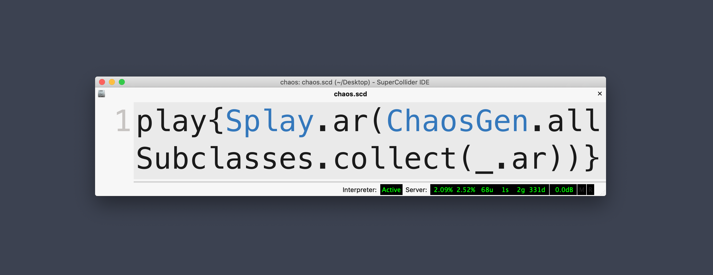

# Awesome SuperCollider

> A curated list of SuperCollider stuff

# Contents

<!-- START doctoc generated TOC please keep comment here to allow auto update -->
<!-- DON'T EDIT THIS SECTION, INSTEAD RE-RUN doctoc TO UPDATE -->

  - [Learning resources](#learning-resources)
    - [Written tutorials](#written-tutorials)
    - [Videos](#videos)
    - [Books](#books)
    - [Research papers](#research-papers)
  - [Plugins](#plugins)
  - [Quarks and extensions](#quarks-and-extensions)
    - [Metacontrol, mapping and gestures](#metacontrol-mapping-and-gestures)
    - [Live coding](#live-coding)
    - [Live Performance](#live-performance)
    - [Controllers](#controllers)
    - [Network](#network)
    - [Physics](#physics)
    - [Buffer management](#buffer-management)
    - [Patterns](#patterns)
    - [Maths](#maths)
    - [Immersive audio](#immersive-audio)
    - [FX](#fx)
    - [Synthesis](#synthesis)
    - [GUI](#gui)
    - [Misc](#misc)
  - [Synthdefs](#synthdefs)
  - [Instruments](#instruments)
    - [Emulations / clones](#emulations--clones)
    - [Granular](#granular)
    - [Other](#other)
  - [Single board computers](#single-board-computers)
    - [Norns](#norns)
    - [Raspberry Pi](#raspberry-pi)
    - [Others](#others)
  - [Clients](#clients)
    - [Language clients](#language-clients)
    - [Livecode interfaces](#livecode-interfaces)
  - [IDE alternatives](#ide-alternatives)
  - [Other tools](#other-tools)
  - [Community](#community)
  - [Build scripts and templates](#build-scripts-and-templates)
- [Development](#development)
  - [Quarks](#quarks)
  - [Writing plugins](#writing-plugins)
  - [Others](#others-1)
  - [Contribute](#contribute)
  - [License](#license)

<!-- END doctoc generated TOC please keep comment here to allow auto update -->

## Learning resources

### Written tutorials
- [A gentle introduction to SuperCollider](https://ccrma.stanford.edu/~ruviaro/texts/A_Gentle_Introduction_To_SuperCollider.pdf) –  Introduction to SC by Stanford's CCRMA
- [How to write server plugins using C++](https://scsynth.org/t/tutorial-supercollider-server-plugins-in-c/3449) - How to create UGens
- [howto_co34pt_liveCode](https://theseanco.github.io/howto_co34pt_liveCode/) - Livecoding tutorial
- [Nick Collins' SuperCollider tutorial](http://composerprogrammer.com/teaching/supercollider/sctutorial/tutorial.html) - Course material for a 12 week course on SuperCollider
- [udk00-Audiovisual_Programming](http://redfrik.github.io/udk00-Audiovisual_Programming/) - Fredrik Olofsson's course materials for UdK Berlin
- [Pseudoclasses with events](https://web.archive.org/web/20141008053015/http://www.tmroyal.com/supercollider-pseudoclasses-with-events.html) - Faking object-oriented programming in SuperCollider with Events
- [SuperCollider_Tutorials](https://github.com/brunoruviaro/SuperCollider_Tutorials) - SC tutorials
- [learn](https://github.com/supercollider/learn) - Official SuperCollider tutorial
- [A-Practical-Guide](http://doc.sccode.org/Browse.html#Streams-Patterns-Events%3EA-Practical-Guide) - A fantastic pattern tutorial (which can also be found in your help files)
- [Minibee Tutorial](http://roosnaflak.com/tech-and-research/minibee-tutorials/) - How to work with the Minibee sensors (for dance performances, etc.) in SuperCollider
- [Mads Kjeldgaard's Tech and research](https://www.madskjeldgaard.dk/posts) - A blog containing a range of tips, tricks and tutorials
- [Implementing a SuperCollider UGen in Rust](http://www.andrewchristophersmith.com/2015/01/01/implementing-a-supercollider-external-in-rust/)
- [SolarPowered SuperCollider on a Raspberry Pi Zero](http://fredrikolofsson.com/f0blog/?q=node/655) - Great little guide for using SC on a solar powered Pi Zero.

### Videos
- [SuperCollider Tutorials](https://www.youtube.com/watch?v=yRzsOOiJ_p4&list=PLPYzvS8A_rTaNDweXe6PX4CXSGq4iEWYC) - Tutorials by Eli Fieldsteel covering a range of subjects
- [Project Free Jazz](https://www.youtube.com/watch?v=AxiG5mjjqzE&list=PLBGCHACLI2b6kawXFK7LayACsIncdyf2f) - A Four part tutorial about algorithmic composition with SuperCollider
- [Audio signal processing in SuperCollider](https://www.youtube.com/playlist?list=PL1Zlv_e8Lv9g2NLtDb0X_VhIw9aR7mcJ7) - A series of lectures by Zlatko Baracskai focusing on audio signal processing. 
- [Live Coding Tutorials](https://www.youtube.com/playlist?list=PLlWmK4qVXO37vgyLeNe8ElF15pInARU6x) - Tutorials specifically about live coding
- [Masterclass "The Ambisonic Toolkit"](http://www.ambisonictoolkit.net/documentation/supercollider/tutorials/) - A general introduction to ambisonics and the ATK
- [Ultimate Arduino-To-Supercollider Tutorials- Control Signals for Digital Audio](https://www.youtube.com/playlist?list=PLAXkVXyP6y5PF2Xy0hMWiKuIdf2Zu6xnG) - How to use the Arduino micro computers with SC
- [Unity 5 and SuperCollider(Custom Sound Engine)](https://www.youtube.com/playlist?list=PLKrJig-8xIiKIznvk_0WArP2ne036TeZV) - How to setup the Unity game engine to work with SuperCollider
- [SuperCollider and Time](https://medias.ircam.fr/xb090dd_supercollider-and-time) - James McCartney (author of SuperCollider) giving a talk at IRCAM
- [SoundEngraver](https://www.youtube.com/channel/UCRxJO2INa3EWX19IfoWqS5Q) - video demos showcasing a variety of things in SC
- [Musical Sound Design in Supercollider video series](https://scsynth.org/t/musical-sound-design-in-supercollider-video-series/2080) - Videos on sound design techniques in SC, including pulsar synthesis examples.

### Books
- [Introduction to SuperCollider](https://www.logos-verlag.de/cgi-bin/engbuchmid?isbn=4017&lng=eng&id=) - Written by Andrea Valle, includes pdf. Published 2016.
- [The SuperCollider Book](https://mitpress.mit.edu/books/supercollider-book) – The essential reference. Edited by Scott Wilson, David Cottle and Nick Collins. Foreword by James McCartney. Published 2011.
- [Example code for The MIT SuperCollider Book](https://github.com/madskjeldgaard/scbookcode)
- [Thor Magnussons Scoring Sound](https://leanpub.com/ScoringSound) - Cookbook containing synthesis recipes among other things
- [Mapping and Visualization with SuperCollider](https://archive.org/details/MappingAndVisualizationWithSuperCollider) - Create interactive and repsonsive audio-visual applications with SuperCollider
- [OXford Handbook of Algorithmic Music](https://www.oxfordhandbooks.com/view/10.1093/oxfordhb/9780190226992.001.0001/oxfordhb-9780190226992) - Not strictly speaking SuperCollider, but a great resource nevertheless.

### Research papers
- [Rethinking the Computer Music Language: SuperCollider](https://www.mitpressjournals.org/doi/pdf/10.1162/014892602320991383) - James McCartney, SuperCollider's father, presenting his work on SuperCollider (2002). 
- [Continued Evolution of the SuperCollider Real Time Synthesis Environment](https://quod.lib.umich.edu/i/icmc/bbp2372.1998.262/--continued-evolution-of-the-supercollider-real-time-synthesis?view=image&seq=1&size=150) - An even older article concerning SuperCollider (1998)
- [It's morphin' time](https://ccrma.stanford.edu/~jhsu/421b/421b_jhsu.pdf) - Sound morphing by Jennifer Hsu
- [Influx – Loose Control, Gain Influence](https://www.3dmin.org/research/open-development-and-design/influx/) - Super interesting article about Alberto de Campo's Influx system and gesture control/mapping in general
- [NNdef: Livecoding Digital Musical Instruments in SuperCollider using Functional Reactive Programming](http://www.friendlyvirus.org/files/Miguel-Negrao-NNdef-FARM-2018.pdf)

### Other documents
- [SuperCollider Tweets](https://sccode.org/1-4RA) - SuperCollider patches in 140 characters. 
- [SuperCollider Tweets Explained](https://ccrma.stanford.edu/wiki/SuperCollider_Tweets) - Comments on some of these tweet-sized patches. 

## Plugins
- [vstplugin](https://git.iem.at/pd/vstplugin) – IEM's VST Plugin integration for SuperCollider (and Pure Data)
- [f0plugins](https://github.com/redFrik/f0plugins) - chip tune UGens
- [flucoma](https://www.flucoma.org/) - FluCoMa, an awesome framework for signal decomposition, machine learning and analysis.
- [steroids-ugens](https://github.com/tai-studio/steroids-ugens) - Standard UGens on steroids
- [super-bufrd](https://github.com/elgiano/super-bufrd) - UGens for accessing long buffers with subsample accuracy
- [xplaybuf](https://github.com/elgiano/XPlayBuf) - A buffer player that can loop and fade, while not suffering from the "float precision issue"
- [bytebeat](https://github.com/midouest/bytebeat) - A bytebeat interpreter 
- [mkplugins](https://github.com/madskjeldgaard/mkplugins) - Mads Kjeldgaard's personal plugins
- [sc3-plugins](http://supercollider.github.io/sc3-plugins/) - The classic sc3-plugins community repository
- [mi-ugens](https://github.com/v7b1/mi-UGens) - 1:1 ports of Mutable Instruments algorithms
- [guttersynth-sc](github.com/madskjeldgaard/guttersynth-sc) - Tom Mudd's Gutter Synth for SuperCollider
- [faustgen](github.com/madskjeldgaard/faustgen-supercollider/) - embedded faust compiler for SuperCollider

## Quarks and extensions

### Metacontrol, mapping and gestures
- [Influx](https://github.com/supercollider-quarks/Influx) - System for complex mapping of gestures

### Live coding
- [SuperDirt](https://github.com/musikinformatik/SuperDirt) - The sound engine of the TidalCycles pattern language
- [JITLibExtensions](https://github.com/supercollider-quarks/JITLibExtensions) - Some extensions to the common JITLib classes
- [xoxo](https://github.com/lvm/xoxo) - Embedded language for SuperCollider
- [INSTRUMENT](https://github.com/punksnotdev/INSTRUMENT) - This tool is aimed at the creation of musical compositions from scratch, 'on the fly'. INSTRUMENT focuses on musical language: rhythm, harmony, melody, audio processing

### Live Performance
- [CuePlayer](https://github.com/dathinaios/CuePlayer) - A tool for composing and performing real-time and mixed electronic works using SuperCollider.

### Controllers
- [Modality Toolkit](https://github.com/ModalityTeam/Modality-toolkit) - Powerful and modal controller library
- [NanoKontrol2](https://github.com/davidgranstrom/NanoKontrol2) - Interface for using Korg NanoKontrol2
- [NanoKontrol](https://github.com/jesusgollonet/NanoKontrol.sc) - Simple use of the Korg NanoKontrol2
- [CC14](github.com/madskjeldgaard/cc14) - 14 bit midi for SuperCollider

### Network
- [Utopia](https://github.com/muellmusik/Utopia) - Network Music Apps in SuperCollider
- [BenoitLib](https://github.com/cappelnord/BenoitLib) - Collaborative and synchronized performances
- [OpenObject](https://github.com/supercollider-quarks/OpenObject) - Share object contents over the network via osc. 

### Physics
- [TraerPhysics](https://github.com/redFrik/TraerPhysics) - A simple particle system physics engine

### Buffer management
- [PolyBuf](https://github.com/madskjeldgaard/PolyBuf) - Easily load and access a bunch of audio files into collections of buffers in SuperCollider
- [Convenience](https://github.com/salkin-mada/Convenience) - Load entire sample banks or folder structures (folders within folders) of audio files into easily accessible collections of buffers. And more.

### Patterns
- [Repetition.sc](https://github.com/lvm/Repetition.sc) - A set of tools to build a Stream of Events using symbols and a sort of language in the language

### Maths
 - [Ease](https://github.com/redFrik/Ease) - Easing and tweening classes for scserver and sclang. Ported from the Cinder C++ framework - original equations by Robert Penner

### Immersive audio
- [The Ambisonic Toolkit](https://github.com/ambisonictoolkit/atk-sc3) - Toolkit for working with spatial sound in the ambisonic domain

### FX
- [Bandsplitter.quark](https://github.com/scztt/BandSplitter.quark) - A great set of filters that will split your audio into multiple components
- [Vowel](https://github.com/supercollider-quarks/Vowel) - Convenience Class for Vowel Creation
- [PitchShiftPA](https://github.com/dyfer/PitchShiftPA) - Phase Aligned pitch shifting
- [DWGReverb](https://github.com/sonoro1234/DWGReverb) - A virtual room generator: It has a FDN reverb for the late response but also early reflections generator based on room dimensions 

### Synthesis
- [CaosPercLib](https://github.com/josecaos/caosperclib) - A Collection of Percussion Classes for SuperCollider
- [CaosBox](https://github.com/josecaos/caosbox) - A not-so-common LiveCoding/AlgoRave music GUI sequencer/processor for the CaosPercLib
- [Particular](https://github.com/madskjeldgaard/Particular) - Particle synthesis on a per particle basis (to be used with patterns)

### GUI
- [wsGUI](https://github.com/dyfer/wsGUI.quark) - User interfaces displayed in a web browser, locally and over the network
- [Automation](https://github.com/neeels/Automation) - Record and playback live GUI activity in supercollider audio synth

### Misc
- [miSCellaneous_lib](https://github.com/dkmayer/miSCellaneous_lib) - various SuperCollider extensions and tutorials: patterns, fx sequencing, granulation, wave folding, sieves, combined lang and server gui control, live coding, single sample feedback, generalized functional iteration synthesis

## SynthDefs
- [Synthdefs](https://github.com/everythingwillbetakenaway/Synthdefs) - Synthdef Pool
- [SynthDefPool](https://github.com/supercollider-quarks/SynthDefPool) — a public library of handy SynthDefs
- [SCLOrkSynths](https://github.com/brunoruviaro/SynthDefs-for-Patterns) — Collection of SuperCollider SynthDefs (synth definitions) for use with Patterns

## Instruments

### Emulations / Clones
- [DX7-SuperCollider](https://github.com/everythingwillbetakenaway/DX7-Supercollider) - accurate Yamaha DX-7 clone. Programmed in Supercollider
- [Benjolis](https://scsynth.org/t/benjolin-inspired-instrument/1074/2) - Instrument inspired by Rob Hordijk's chaotic Benjolin synth
- [B700s](https://github.com/lantertronics/b700ish) - A clone of the Buchla 700

### Granular
- [granular-synth](https://github.com/cagnolone/granular-synth) - A simple granular synth GUI, with a handy time/frequency graph
- [granular from Discrete Structures course](https://raw.githubusercontent.com/redFrik/udk18-Discrete_Structures/master/udk171214/granulator.scd) - loads a folder of files into buffers and granulates everything.

### Other
- [LNX Studio](http://lnxstudio.sourceforge.net/) - a Digital Audio Work Station. [Repository](https://github.com/neilcosgrove/LNX_Studio)
- [TXmodular](http://www.palemoonrising.co.uk/) - TXmodular is a production environment fully written in SC

## Single board computers
### Norns
- [Monome norns, SuperCollider and Lua](https://medium.com/@kidsputnik/monome-norns-supercollider-and-lua-part-1-d97646306973) - Nice tutorial on getting started with SuperCollider/LUA on the Norns platform

### Raspberry Pi
- [Solar powered SuperCollider](http://fredrikolofsson.com/f0blog/?q=node/655) - Running SC on a Solar powered Raspberry Pi Zero
- [Notes for setting up a Raspberry Pi 4 for audio work](https://madskjeldgaard.dk/posts/raspi4-notes/) - A comprehensive guide for tuning Raspbian and using (latest version of) SuperCollider
- [Networked audio using Raspberry Pi 4, zita-njbridge and SuperCollider](https://madskjeldgaard.dk/posts/raspi-zita-njbridge/) - Do networked audio on the Pi using SuperCollider
- [Prynth](http://prynth.github.io/) - Prynth are programmable sound synthesizers powered by Raspberry Pi
- [supercolliderStandaloneRPI2](https://github.com/redFrik/supercolliderStandaloneRPI2) - Standalone for Raspberry Pi 2 or 3 with Raspbian Stretch including the full IDE
- [supercolliderStandaloneRPI1](https://github.com/redFrik/supercolliderStandaloneRPI1) - Standalone for Raspberry Pi 1 or Zero with Raspbian Stretch including the full IDE
- [Building SuperCollider for piCore Linux](http://fredrikolofsson.com/f0blog/?q=node/672) - Great guide for installing stuff on PiCoreLinux

### Others
- [Bela](https://blog.bela.io/2017/10/29/bela-and-supercollider-live-coding-sensors/) - Bela is an embedded computing platform for creating responsive interactive applications
- [Salt](https://blog.bela.io/2018/05/02/salt-a-programmable-eurorack-syntesizer/) - Bela powered programmable Eurorack module
- [OpenBCI-SuperCollider](https://github.com/krisztian-hofstadter-tedor/OpenBCI-SuperCollider) - SuperCollider classes for communicating with Open Brain Computer Interface
- [IBVA-BlueVAS-SuperCollider](https://github.com/krisztian-hofstadter-tedor/IBVA-BlueVAS-SuperCollider) -
A SuperCollider class for communicating with the IBVA EEG brain wave measurement headset
- [VCV Rack Prototype Module](https://vcvrack.com/Prototype) - A digital Eurorack module scriptable using SuperCollider 

## Clients
### Language clients
- [SuperColliderJS](https://crucialfelix.github.io/supercolliderjs/) - JavaScript client
- [hsc3](http://hackage.haskell.org/package/hsc3) - Haskell client
- [Lua2SC](https://github.com/sonoro1234/Lua2SC) - Lua client
- [ScalaCollider](https://github.com/Sciss/ScalaCollider) - Scala client
- [supriya](https://github.com/josiah-wolf-oberholtzer/supriya) - Python client
- [sc3](https://github.com/smrg-lm/sc3) - Python port of some of sclang's features
- [cl-collider](https://github.com/byulparan/cl-collider) - CommonLisp client
- [sc_client](https://github.com/tonikasoft/sc_client) - Rust client
- [sorceress](https://github.com/ooesili/sorceress) - Creative coding in Rust / SuperCollider

### Livecode interfaces
- [TidalCycles](http://tidalcycles.org/) - Haskell based live coding environment for patterns
- [FoxDot](https://foxdot.org/) – Python based live coding environment running on top of SuperCollider
- [Overtone](http://overtone.github.io/) - Collaborative live coding using Clojure
- [Sonic Pi](https://sonic-pi.net/) - Ruby based live coding environment, using SuperCollider as an audio engine 
- [xi](https://github.com/xi-livecode/xi) - A domain-specific language for live coding musical patterns in Ruby
- [Ixi Lang](http://www.ixi-audio.net/ixilang/) - Thor Magnusson's live coding environment based on musical agents

## IDE alternatives
- [atom-supercollider](https://github.com/crucialfelix/atom-supercollider) - SuperCollider integration for Atom
- [scvim](https://github.com/supercollider/scvim) - Vim plugin
- [scnvim](https://github.com/davidgranstrom/scnvim) - NeoVim plugin
- [scel](https://github.com/supercollider/scel) - Emacs interface
- [vscode_supercollider](https://github.com/salkin-mada/vscode_supercollider) - Supercollider syntax for Visual Studio Code
- [Hadron](https://github.com/htor/hadron-editor) - Simple editor with help browser and post window
- [sckernel](https://github.com/andrewdavis33/sckernel) - Jupyter Notebook kernel

## Other tools
- [supercollider-tree-sitter](https://github.com/madskjeldgaard/tree-sitter-supercollider) - A tree-sitter grammar for SuperCollider (supported out of the box in [treesitter-nvim](https://github.com/nvim-treesitter/nvim-treesitter) for example). 

## Community
- [scsynth.org](http://scsynth.org/) - Official SuperCollider forum
- [sccode.org](http://sccode.org/) - A website containing SuperCollider code. Many years worth of good ideas in here.
- [Slack](https://scsynth.slack.com/) - The SuperCollider Slack
- [Lurk](https://talk.lurk.org/channel/supercollider) – Livecode chat
- [Mailing list](https://www.birmingham.ac.uk/facilities/ea-studios/research/supercollider/mailinglist.aspx) - Former official mailing list. Archives are in the process of being moved to a new location.
- [Telegram](https://t.me/supercollider_en) - Telegram SuperGroup
- [Telegram ES](https://t.me/supercollider_es) - Telegram SuperGroup in Spanish
- [Facebook](https://www.facebook.com/groups/supercollider/) - The SuperCollider facebook group
- [Discord](https://discord.gg/TbBtCXxp5p) - The SuperCollider Discord Server
- [Stackoverflow](https://stackoverflow.com/questions/tagged/supercollider) - SuperCollider discussions on StackOverflow

## Build scripts and templates
- [Build script for Linux](https://github.com/lvm/build-supercollider) - Easily build SuperCollider with plugins from source on Linux (Ubuntu/Debian)

# Development

## Quarks
- [Cookiecutter template for SuperCollider quarks](https://github.com/madskjeldgaard/cookiecutter-quark) - A SuperCollider package (quark) generator using the Cookiecutter cli program. The fastest way to get setup for a quark

## Writing plugins
- [Example plugins](https://github.com/supercollider/example-plugins) - Simple and understandable examples of cpp plugins for SC
- [Server Plugins API](http://doc.sccode.org/Reference/ServerPluginAPI.html) - Description of some of the boilerplate you get for writing UGens / plugins
- [Cookiecutter template for SuperCollider plugin](https://github.com/supercollider/cookiecutter-supercollider-plugin) - cookiecutter project for SuperCollider server plugins
- [Implementing a SuperCollider plugin in Rust](http://www.andrewchristophersmith.com/2015/01/01/implementing-a-supercollider-external-in-rust/)
- [UGen quality standards](https://github.com/supercollider/supercollider/wiki/UGen-Quality-Standards)

## Others
- [superfomus](https://github.com/smoge/superfomus) - bindings to Fomus Music Notation (FOrmat MUSic)
- [SuperColliderAU](https://github.com/supercollider/SuperColliderAU) - SuperColliderAU is an AudioUnit wrapper that allows using SuperCollider servers inside AudioUnits hosts on macOS. The embedded server may be controlled over OSC as usual

## Contribute

All contributions welcome!

Read the [contribution guidelines](contributing.md) first.

## License

To the extent possible under law, Mads Kjeldgaard has waived all copyright and
related or neighboring rights to this work.

Table of Contents generated using doctoc
